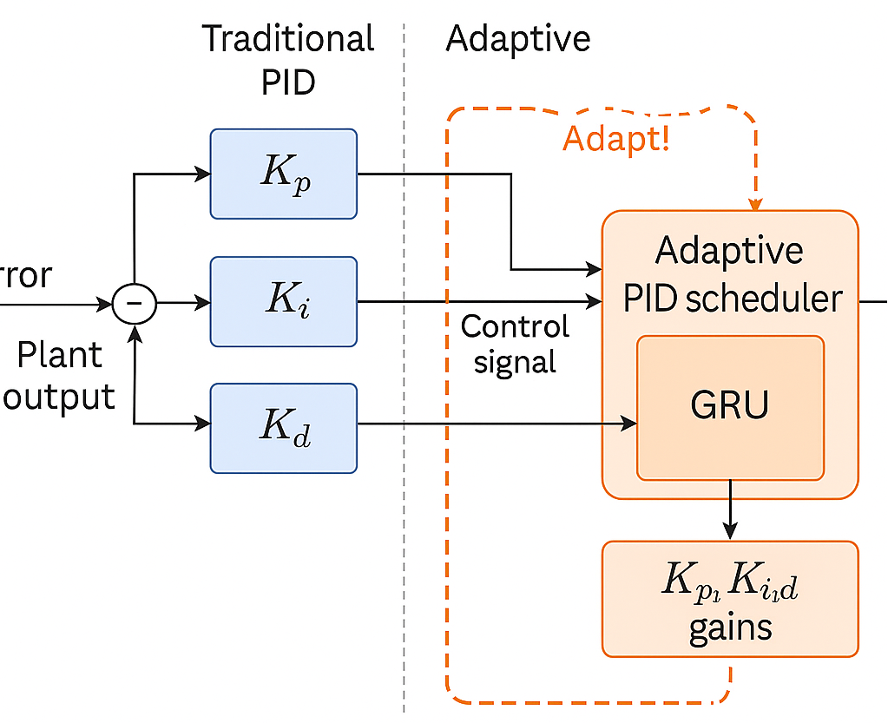
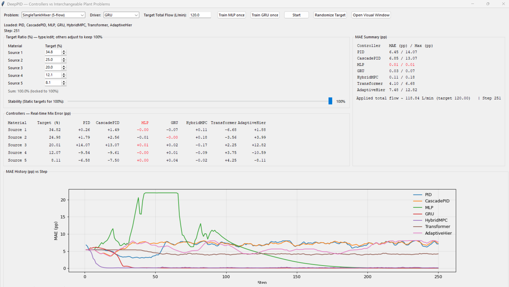

# DeepPID — A deep learning–based adaptive PID controller

[](https://github.com/Pieter-Cawood/DeepPID/actions/workflows/ci.yml)
[](./LICENSE)
<!-- Replace OWNER/REPO below after pushing this repo to GitHub -->


A clean, documented playground for **classic PID control** and **ML‑assisted controllers** you can
run live. It includes an interactive Tkinter+Matplotlib GUI (`examples/test.py`) that compares
multiple controllers on interchangeable “problems” (plants).






## What’s inside

- **PID**: IMC‑style auto‑tuned PID with anti‑windup, bumpless transfer, and online refinement.
- **CascadePID**: stabilized inner PID with outer composition/total loops.
- **Neural controllers**: MLP, GRU, Transformer, PINN‑flavored, a hybrid MPC stub, and safety‑wrapped RL stub.
- **GUI**: real‑time MAE table + history plot for apples‑to‑apples comparisons.
- **Packaging**: imports work (`import deeppid`) and examples run out of the box.

> Tip: The MAE History plot has a transparent background so it blends with your system theme.

## Install (editable)

```bash
python -m venv .venv
# Linux/macOS
source .venv/bin/activate
# OR Windows PowerShell
.venv\Scripts\activate
pip install -e .
```


## Quick start (GUI)

```bash
python examples/test.py
```

This launches the controller shoot‑out app. Choose any plant from the dropdown, pick a driver
(controller), and watch the **real‑time mix error** and **MAE history** update as the set‑point moves.

## Project layout

```text
deeppid/
  controllers/
    controllers.py        # PID, CascadePID, MLP, GRU, Transformer, etc.
  envs/
    problems.py           # “Problems”/plants with labels, units, limits
examples/
  test.py                 # Tk + Matplotlib live comparison app
tests/                    # (optional) put your pytest tests here
```

## How the GRU controller works (and why it’s different from PID)

**Conventional PID** computes the next actuation using fixed (or slowly tuned) gains `Kp, Ki, Kd`
around an interpretable structure with anti‑windup and filters. It’s great when the plant can be
reasonably approximated by first/second‑order dynamics and the operating point doesn’t move too much.

**GRU controller (adaptive & live)** takes a different tack:

- **State** each tick: `[target ratio, total set‑point, recent measured flows, previous speeds]`.
- **Sequence model**: a GRU processes the recent context to estimate the next speeds in one shot.
- **Hard safety layer**: speeds are **slew‑limited** and **clamped** to `[min, max]`.
- **Online objective** (optimized every few steps):
  - match **composition** (fractions) to target,
  - match **total** output to the requested value,
  - keep **smooth** changes (actuator wellness),
  - stay inside bounds with a **soft barrier**,
  - optionally track a reference/baseline (e.g., PID suggestion).
- **Why it helps**: when the plant is nonlinear, coupled, or operating conditions drift, the GRU
  can “learn” mappings PID would need re‑tuning for. You still keep the same safety rails as PID.

You can inspect all loss terms and constraints in `controllers.py` (classes `GRUController`, `MLPController`).
Everything is implemented to be **stable‑by‑construction**: we never bypass slew/clamp and we bias to
baseline allocations when signals are missing or become non‑finite.

## License

MIT
